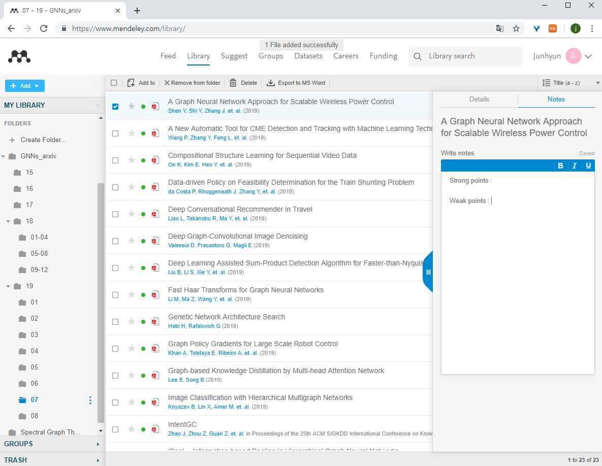

This repo is the slightly modified version of https://github.com/karpathy/arxiv-sanity-preserver.

## Crawling and Organizing arxiv papers

1. Build virtual env.

`conda env create -f arxiv-env.yml`


2. Set your search keywords(list) at `utils.py`.
(search for articles that contain the keywords in the abstract.)

```python
class Config(object):
    search_list = ["graph convolution","graph neural network"]
    # search query : [graph] AND [convolution] OR [graph] AND [neural] AND [network]
    save_pdf_by_title = True
    # if save_pdf_by_title = False, the pdf file will be saved as 1805.07857v2.pdf
    save_pdf_by_months = True
    # if save_pdf_by_months = False, the files will not be organized by months. (will be organized by years.)
```

3. Run `source crawling.sh`
```sh
conda activate arxiv-env

python fetch_papers.py --max-index=1000  # maximum number of papers
python download_pdfs.py

# repeat
python fetch_papers.py --max-index=1000
python download_pdfs.py

conda deactivate
```

4. (Optional) Put papers on Mendeley library.

You can write simple review at note and organize by using tags.
(searching papers based on notes and tags)




